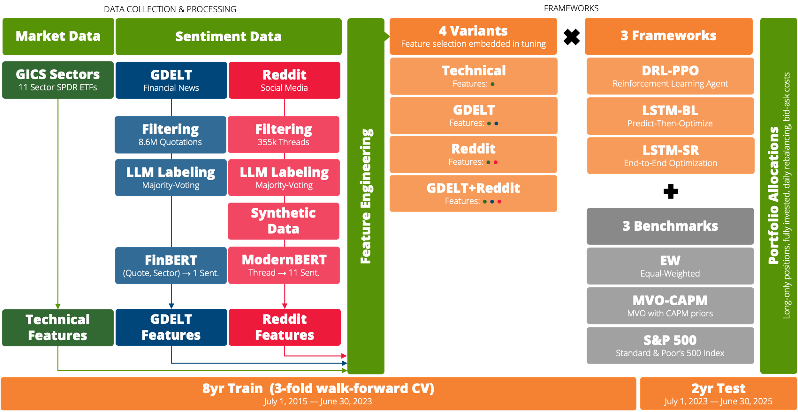

# Portfolio Optimization of GICS Sector ETFs with Market Signals Based on NLP

MSc thesis (Master's in Data Science, University of Aveiro) — **Hugo Veríssimo**

Can NLP-derived sentiment improve portfolio optimization? This thesis
extracts sector-level sentiment from two open textual streams —
**institutional financial news** (GDELT, 8.6M quotations,
processed with a FinBERT pipeline) and **retail investor social media**
(Reddit, 355k threads, processed with a ModernBERT pipeline) — and feeds it to three
portfolio optimization frameworks over the 11 GICS sector SPDR ETFs:

- **DRL–PPO** — Deep Reinforcement Learning agent (Proximal Policy Optimization)
- **LSTM–BL** — LSTM ensemble for return prediction, feeding a Black-Litterman construction (predict-then-optimize)
- **LSTM–SR** — end-to-end LSTM trained to directly maximize the Sharpe ratio

Each framework runs under four feature variants (technical baseline,
+GDELT, +Reddit, +both) against three benchmarks (equal-weight, MVO–CAPM,
S&P 500), with 8 years of walk-forward training and a 2-year out-of-sample
test (Jul 2023 – Jun 2025), long-only, fully invested, daily rebalancing,
net of bid-ask costs. **Findings:** sentiment adds value across all
frameworks — institutional news mainly improves risk control, retail social
media correlates more with return generation, and their combination yields
the most balanced risk-return profile.

📄 **[thesis.pdf](thesis.pdf)** · 🎞️ **[slides.pdf](slides.pdf)**

## Pipeline



| Directory | Contents |
|---|---|
| [`01_data/`](01_data/) | Data collection: Reddit dump, GDELT news, SEC 10-K filings, GICS dictionaries, ETF prices; `processed/` holds the experiment-ready inputs |
| [`02_sentiment/`](02_sentiment/) | LLM labeling (majority voting: Qwen / Gemini / Llama); news sentiment models (iterations v1→v2→**vf2**); Reddit sentiment models (ModernBERT multi-head, v1→v2→**v4**) |
| [`03_portfolio/`](03_portfolio/) | DRL_PPO (DRL–PPO), LSTM_returns (LSTM–BL), LSTM_sharpe (LSTM–SR) — each × {technical, +reddit, +news, +both}; benchmarks: MVO–CAPM, EW, S&P 500 |
| [`04_results/`](04_results/) | Results notebooks, thesis figures, canonical portfolio `weights/` |
| [`src/`](src/) | Shared code: `config` (paths), `seeds`, `metrics` (PortfolioMetrics), `data`, `plotting`, `cv_report` |
| [`envs/`](envs/) | Exact conda environments used per pipeline stage |
| [`thesis/`](thesis/) | Thesis raw materials: LaTeX chapters, figures (`figs/`, generated by the notebooks), references |

## Setup

Each pipeline stage ran in its own conda environment — pick the one for the
stage you want (mapping below), then install the shared `src` package into
it:

```bash
conda env create -f envs/<name>.yml
conda activate <name>
pip install -e .   # makes `from src...` work in every notebook
```

| Env | Used for |
|---|---|
| `01_gdelt_data` | GDELT extraction (`01_data/news_collection.ipynb`, GDELT EDA) |
| `01_reddit_data` | Reddit extraction (`01_data/reddit_collection.ipynb`) |
| `02_labeling` | LLM labeling (`02_sentiment/labeling/`) |
| `02_sentiment_gdelt` | FinBERT/GDELT sentiment models (`02_sentiment/news/`) |
| `02_sentiment_reddit` | ModernBERT/Reddit sentiment models (`02_sentiment/reddit/`) |
| `03_drl_ppo` | `03_portfolio/DRL_PPO/` |
| `03_lstm` | LSTM–BL + LSTM–SR (`03_portfolio/LSTM_*/`) |
| `03_mvo_capm` | `03_portfolio/benchmarks/MVO_CAPM/` |
| `03_portfolio_base` | dataset assembly + base portfolios (`03_portfolio/dataset.ipynb`, EW, SP500) |

Secrets (only needed to re-run data collection): copy
[`src/secrets_example.py`](src/secrets_example.py) to `src/secrets.py` and
fill in your keys — it is gitignored.

## Reproducing the study

Everything needed to *analyze* the results ships in the repo. A few large
raw files (Reddit dump, SEC 10-K corpus, trained model weights) are
excluded for size, but each is downloadable or rebuilt by the notebook that
produced it — tiny `*_SAMPLE.parquet` files ship so you can inspect schemas
without downloading anything. Acquisition details live in each stage's
README (start with [`01_data/README.md`](01_data/README.md)); all seeds are
in [`src/seeds.py`](src/seeds.py), exactly as used for the thesis.

1. **Data** — run `01_data/` notebooks (network + credentials needed for
   GDELT/BigQuery; Reddit dump via torrent), then
   `01_data/processed/build_model_inputs.ipynb`.
2. **Sentiment** — labeling batches ship in `02_sentiment/labeling/`;
   train the sentiment models with the `v*`/`vf2` notebooks (GPU
   recommended); extract features with the `as_feature/` notebooks.
3. **Portfolio** — build `03_portfolio/dataset.ipynb`, then run each
   strategy notebook (training saves weights next to the notebook; the
   canonical thesis weights live in `04_results/weights/`).
4. **Results** — `04_results/results_pt1..3.ipynb` and `others/`.

Every notebook starts with a header cell stating its purpose, inputs and
outputs. Notebooks that need a GPU or network access say so there.

## Results

Full comparison across frameworks and feature variants is in
[`04_results/`](04_results/) and thesis chapters 5–6; figures used in the
document are generated into `thesis/figs/`.

## About this repository

This public repository was produced from the private working repository of
the thesis by an AI model — **Claude (Fable 5), running autonomously in
Claude Code** — with essentially no human intervention and only light human
review. The entire refactor (restructuring into pipeline stages, extracting
shared code into `src/`, replacing hardcoded paths, scrubbing credentials, stripping outputs and writing this documentation)
was planned, executed and verified by the model; correctness was checked
with the model's own automated verifications (path-existence checks, seed
round-trip diffs, re-executing notebooks) rather than manual inspection, so
treat repository *organization* accordingly. All experiments, data
processing and results are the original human thesis work, unchanged —
original notebook outputs are preserved in the private archive.

## License

Code is released under the [MIT License](LICENSE). The datasets keep their
upstream terms (Reddit dump via Academic Torrents, GDELT, SEC EDGAR,
yfinance/FRED market data) — see [`01_data/README.md`](01_data/README.md).

## Citation

```bibtex
@mastersthesis{verissimo2026nlpportfolio,
  title  = {Portfolio Optimization of GICS Sector ETFs with Market Signals
            Based on Natural Language Processing},
  author = {Ver{\'i}ssimo, Hugo},
  school = {University of Aveiro},
  year   = {2026},
}
```
